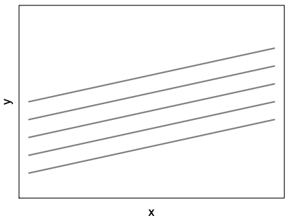
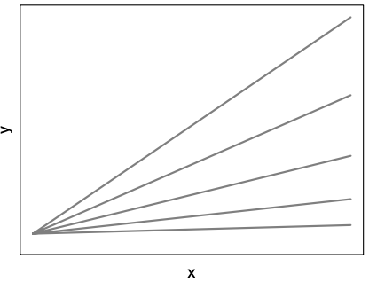

```{r setup, include=FALSE}
knitr::opts_chunk$set(echo = TRUE)
```

This session takes our Week 8 example to another level, by taking both country-level and region-level data into account. The models that we will now use are called __mixed__, __multilevel__ or __hierarchical__ models for that reason. Calling them 'mixed' is also a way to point out that these models will contain two types of effects, fixed and random, which mean something different than in the context of panel models.

## Packages

The [`lme4` package][lme4] will provide most of the functions that we will need today to fit our multilevel models. It comes with good vignettes on [its syntax][lme4-syntax], and on [how it estimates the models][lme4-theory].

[lme4]: https://cran.r-project.org/package=lme4
[lme4-syntax]: https://cran.r-project.org/web/packages/lme4/vignettes/lmer.pdf
[lme4-theory]: https://cran.r-project.org/web/packages/lme4/vignettes/Theory.pdf

The other packages that we will need are packages to manipulate the results. The [`broom` package][broom] will still work for multilevel models, but only if the additional [`broom.mixed` package][broom-mixed] is installed.

[broom]: https://cran.r-project.org/package=broom
[broom-mixed]: https://cran.r-project.org/package=broom.mixed

```{r packages, message = FALSE}
library(haven)
library(tidyverse)

# multilevel model estimators
library(lme4)

# model manipulation
library(broom)
library(broom.mixed)
library(ggeffects)
library(modelsummary)
library(performance)
```

Note the addition of the [`ggeffects` package][ggeffects] to the list of model helpers that we load here. This package will let us compute (and plot) the __predicted values__ and __marginal effects__ of our models, which is a strategy that is also useful when working with other kinds of models.

Last, let's install the `visibly` package, which is not available through CRAN but can be installed from GitHub instead:

```{r install-visibly}
library(remotes)
remotes::install_github("m-clark/visibly")
```


## Multilevel data

The extract of the [European Social Survey][ess] (ESS) that we will use comes directly [from the ESS website][ess-ml]. The data have been prepared and merged by the ESS team, which is a huge time-saver: merging individual-level to country-level and/or region-level data is not difficult, but it does take time to perform.

[ess]: https://europeansocialsurvey.org/
[ess-ml]: https://ess.sikt.no/en/multilevel/

We are again working with data from Round 7 (c. 2014), although with a slightly different set of variables:

```{r load-ess}
# load the data extract
ess7 <- haven::read_dta("data/ess2014-multilevel-extract.dta")

# data overview
glimpse(ess7)
```

Some of the variables are individual-level, but one is measured at the __country-level__ (`c_gini_2014`, which measures the Gini coefficient of equivalised disposable income in 2014), and several others are measured at the __region-level__, such as `n2_cnmigrat_2014`, which measures net migration at the [NUTS-2 level][nuts].

[nuts]: https://ec.europa.eu/eurostat/web/nuts/overview

```{r data-ml}
# available countries
count(ess7, cntry)

# available NUTS-1 regions
count(ess7, cntry, nuts1)

# available NUTS-2 regions
group_by(ess7, cntry, nuts1) %>% 
    summarise(
        regions = str_c(unique(nuts2), collapse = ", ") %>% 
          str_trunc(45)
    ) %>% 
    print(n = Inf)
```

The result is a dataset that comes with four levels of data: (1) individuals, who are _nested_ within (2) NUTS-2 regions, which are themselves _nested_ within (3) NUTS-1 regions, which are themselves _nested_ within (4) countries. That's the kind of data that you want to approach with multilevel models, which can also handle data with cross-level memberships (e.g. Czech citizens living in Belgium).

The models that we will estimate focus on three of the available levels: country, NUTS-2 region, and individual. Note that some of the countries included in the ESS do not feature the region-level data that we plan to use:

```{r nuts2-data}
# long-term unemployment (12 months and more), percentage of active pop.
with(ess7, table(cntry, is.na(n2_loun_pc_une_2014)))
```

## Data preparation

Our next steps are taken from a recent preprint that works on [linking ESS data to ParlGov data][ess-linking]:

- We first exclude respondents with an excessively high number of education years (`eduyrs`);
- We then restrict the dataset to our variables of interest, in order to drop observations with missing values;
- And last, we [rescale][scale] our continuous predictors at zero, which is recommended when working with multilevel models.

```{r data-preparation}
eduyrs_cap <- quantile(ess7$eduyrs, probs = 0.99, na.rm = TRUE) # 23

ess_lm_c <- ess7 %>% 
  filter(eduyrs < eduyrs_cap) %>% 
  select(euftf, gndr, eduyrs, agea, lrscale, 
         cntry, nuts2, c_gini_2014, n2_loun_pc_une_2014, n2_cnmigrat_2014,
         pspwght) %>% 
  na.omit() %>% 
  mutate(
    female = if_else(gndr == 2, 1, 0),
    across(c(agea, eduyrs, lrscale, c_gini_2014,
             n2_loun_pc_une_2014, n2_cnmigrat_2014),
           \(.x) as.vector(scale(.x, scale = FALSE)),
           .names = "{.col}_c"
    )
  )

# final sample
count(ess_lm_c)
```

[ess-linking]: https://github.com/hdigital/ess-linking
[scale]: https://www.rdocumentation.org/packages/base/versions/3.6.2/topics/scale

Rescaling as we did above means that all our continuous variables, such as `lrscale`, for instance, will have a mean of zero:

```{r lrscale}
summary(ess7$lrscale)
summary(ess_lm_c$lrscale_c)
```

This will make sense in a few minutes, when we introduce varying intercepts.

## Linear mixed models

> __Readings and video tutorials:__ what follows is a very short introduction to linear mixed models based on notes taken from [Daniel Stegmueller][stegmueller]. For a longer introduction, I recommend [Ian Brunton-Smith's NCRM video course][brunton-smith], which will walk you through the same steps that we take below, with a good teaching example. For an introduction that focuses on the estimation of mixed models with R, turn to [Michael Clark's notes][clark], or to [Erin M. Buchanan's video workshop][buchanan].

[stegmueller]: https://www.daniel-stegmueller.com/
[brunton-smith]: https://www.youtube.com/watch?v=YLkXP3Edd80&list=PL-XAd1-IhZXZxcWfV0ErYVwPSvGzZ2Lup
[clark]: https://m-clark.github.io/mixed-models-with-R/
[buchanan]: https://www.aggieerin.com/post/multilevel-modeling-workshop-materials/

The point of a _mixed_ model is to let us do something with the substantive hierarchy of, in this case, countries, regions and individuals that is reflected in our data. Instead of applying ex-post (standard error) corrections to the model, we will basically estimate __different regression models at each level__, while also holding different assumptions about the error distribution at each level.

The most basic approach to multilevel modelling consists in running a separate regression for each group (level), while letting the intercept of that group vary, as in 

$$Y_{ij} = \beta_0 + \beta_1 X_{ij} + u_{0j} + \epsilon_{ij}$$

... where $i$ denotes the lowest group (individuals) in our data, and $j$ the higher-level group (regions nested within countries). In this model, the intercept of each group $j$ is $\beta_0 + u_j$, with $u \sim \mathcal{N}(0, \sigma^2_u)$ and $\epsilon \sim \mathcal{N}(0, \sigma^2_\epsilon)$.

The visual result of this __varying-intercept__ model is shown in the figure on the left below, whereas the one on the right shows what happens if we instead ask for a __varying-slope__ model by replacing $\beta_1 X_{ij}$ with $\beta_1 X_{ij} + u_{1j} X_{ij}$, in which case the slope of the regression line for group $j$ becomes $\beta_1 + u_{1j}$.

 

The beauty of these models is that you can have _both_ varying intercepts ($u_{0j}$) and varying slopes ($u_{1j}$) in your model equation. The varying intercepts will provide you with an estimate of how different your groups are from each other, whereas the varying slopes will tell you about how different your observations are within each group.

This is the same 'between-group and within-group variations' logic that we followed when looking at panel models, except that we are now preserving these variations, and estimating how much variance comes from each level. For that reason, our models are fundamentally an exercise in __variance partitioning__.

Check out the excellent [visual explanation by Michael Freeman][mfviz] to see the different kinds of models mentioned above in action.

[mfviz]: http://mfviz.com/hierarchical-models/

## Estimating the models

Let's start by reworking the model equation that we used in Week 8, this time with interactions, quadratic terms, and some country-level and region-level predictors:

```{r model-equation}
eqn <- formula(
  euftf ~ 
    poly(agea_c, 2) + 
    female * eduyrs_c + 
    female * poly(lrscale_c, 2) + 
    c_gini_2014 + 
    n2_loun_pc_une_2014_c + 
    n2_cnmigrat_2014_c
)
```

Throwing this equation into a plain OLS estimator will work, but that would amount to performing __no pooling__ at all, i.e. completely ignoring the group (country/region) membership of our observations. Instead, we could also estimate a separate model per country/region, but that would result into __complete pooling__ and would differentiate each group from each other more than we want.

What we will do in the end is to estimate a mixed model that performs __partial pooling__ on the observations. The end of the model formula is the crucial part that performs the trick:

```{r lmer}
# partial pooling, country-level only
m1 <- lme4::lmer(
  update.formula(eqn, ~ . + (1 | cntry)),
  weights = pspwght,
  data = ess_lm_c
)

# partial pooling, countries and regions separately
m2 <- lme4::lmer(
  update.formula(eqn, ~ . + (1 | cntry) + (1 | nuts2)),
  weights = pspwght,
  data = ess_lm_c
)

# partial pooling, regions nested within countries
m3 <- lme4::lmer(
  update.formula(eqn, ~ . + (1 | cntry / nuts2)),
  weights = pspwght,
  data = ess_lm_c
)

# display, with fancy formats for each goodness-of-fit metric
f3int <- function(x) format(round(x, 3), big.mark = ",")
f3dbl <- function(x) format(round(x, 3))
modelsummary::modelsummary(
  list(m1, m2, m3), stars = TRUE,
  gof_map = list(
    list("raw" = "nobs", "clean" = "N", "fmt" = f3int),
    list("raw" = "icc", "clean" = "ICC", "fmt" = f3dbl)
  )
)
```

Model 3 is the model that you want to be looking at, although we really shouldn't be looking at [_p_-values in mixed models][no-p]… You can still get them with `modelsummary`, or by manipulating the model object with `broom` (not shown here), though.

To better understand what is happening, it might help to start with an empty model first:

[no-p]: https://bbolker.github.io/mixedmodels-misc/glmmFAQ.html#why-doesnt-lme4-display-denominator-degrees-of-freedomp-values-what-other-options-do-i-have

```{r no-predictors}
m0 <- lme4::lmer(
  formula(euftf ~ 1 + (1 | cntry / nuts2)),
  weights = pspwght,
  data = ess_lm_c
)

summary(m0)
```

The results above provide you with the estimated average value of your dependent variable (`4.854`), as well as with the variance captured at the country-level (`0.2129`), and the variance captured at the region-level (`0.1181`). You will sometimes see the ratio of group-level variance to total variance referred to as the __intra-class correlation__ (ICC), or __variance partitioning coefficient__. Getting it is straightforward with the `performance` package:

```{r icc}
performance::icc(m0, by_group = TRUE)
```

## Random effects

The ICC is very much related to the R-squared in a linear model -- both are ratios of variance components. The R-squared of a mixed model can be computed in more than one way, but you will more often see comparisons of model performance using either the ICC or the Bayesian Information Criterion (BIC) of the model:

```{r model-performance}
performance::compare_performance(m0, m1, m3, metrics = c("BIC", "ICC", "RMSE"))
```

When looking at these indicators, you are inspecting how much variance got absorbed at the higher levels of your models. This is what are called the __random effects__ of the models:

```{r random-effects}
lme4::ranef(m3) %>% 
  lapply(head)
```

These effects are the varying intercepts that we mentioned earlier. Given how we specified the model, we get one for each country/region, with a confidence interval that can easily be obtained through the `visibly` package:

```{r estimate-ranef}
# country/region-level random effects, as estimates
visibly::plot_coefficients(m3, ranef = TRUE, 
                           which_ranef = "nuts2:cntry", plot = FALSE) %>% 
  arrange(Coefficient) %>% 
  select(Coefficient, value, ui_l, ui_u) %>% 
  head()
```

This package is also interesting for its plotting functions, which will let you get some plots of your higher-level random effects:

```{r visualize-ranef}
# country-level random effects, as a plot
visibly::plot_coefficients(m3, ranef = TRUE, which_ranef = "cntry", plot = TRUE)
```

## Fixed effects

The variance captured at the level of your lower-level (in our case, individual-level) predictors are called the __fixed effects__ of the model. This is what our results table showed first and foremost. Let's look at them again, through their predicted values across their entire range:

```{r predictions}
# predicted effect of long-term unemployment rates
ggeffects::ggpredict(m3, terms = "n2_loun_pc_une_2014_c [all]") %>% 
    plot(show.title = FALSE, show.legend = FALSE)

# predicted effect of net migration
ggeffects::ggpredict(m3, terms = "n2_cnmigrat_2014_c [all]") %>% 
    plot(show.title = FALSE, show.legend = FALSE)

# predicted effect of age
ggeffects::ggpredict(m3, terms = "agea_c [all]") %>% 
    plot(show.title = FALSE, show.legend = FALSE)

# predicted effect of left-right placement
ggeffects::ggpredict(m3, terms = "lrscale_c [all]") %>% 
    plot(show.title = FALSE, show.legend = FALSE)
```

The last two effects above are both curvilinear because we specifically asked for the predictors to include a quadratic term. This will not be the case with predictors that were estimated only through their linear effect, as in the case of the first interaction below:

```{r interactions}
# predicted effect of education, by sex
ggeffects::ggpredict(m3, terms = c("eduyrs_c [all]", "female")) %>% 
    plot(show.title = FALSE, show.legend = FALSE)

# predicted effect of left-right placement, by sex
ggeffects::ggpredict(m3, terms = c("lrscale_c [all]", "female")) |>
    plot(show.title = FALSE, show.legend = TRUE)
```

* * *

Finally, note that even though our example focuses on linear mixed models estimated with the `lmer` function, __generalized linear mixed models__ (GLMMs) are also available through the `lme4` package and its ` glmer` function. Everything showed above will apply to these models, except predicted values will become predicted probabilities.
